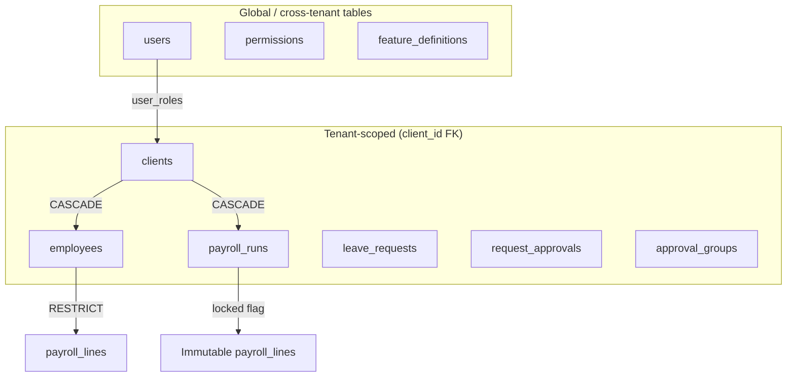

# CG Payroll — Database Entity-Relationship Diagram

> **Source of truth:** `api/prisma/schema.prisma`  
> **Flow context:** `FLOWS.md`  
> **Engine:** PostgreSQL 16 · Prisma 6 · NestJS modular monolith

This document describes the full production-grade, multi-tenant database schema for CG Payroll. The design uses **shared-schema row-level tenancy** (`clients` = tenant root), **UUID primary keys**, **tenant-scoped unique constraints**, and **ACID-oriented foreign-key delete rules**.

---

## Table of Contents

1. [Architecture Overview](#architecture-overview)
2. [Complete System ERD](#complete-system-erd)
3. [Domain Groupings](#domain-groupings)
4. [Multi-Tenancy & ACID Rules](#multi-tenancy--acid-rules)
5. [Tenant-Scoped Uniqueness](#tenant-scoped-uniqueness)
6. [Polymorphic Approval Links](#polymorphic-approval-links)
7. [Entity Index](#entity-index)

---

## Architecture Overview

| Principle | Implementation |
|-----------|----------------|
| **Multi-tenancy** | One `clients` row per tenant; `client_id` on nearly every domain table |
| **Tenant resolution** | `X-Client-Id` header → route param → `users.primary_client_id` |
| **Isolation** | Composite `UNIQUE (client_id, …)` on business keys (`emp_id`, `asset_tag`, etc.) |
| **ACID transactions** | Prisma `$transaction` for onboarding, invitations, payroll runs |
| **Immutability** | `payroll_lines.snapshot_data`, `request_approvals.value_minor`, `separations.eosb_breakdown` |
| **Money** | `BIGINT` minor units (no floats); rates in basis points (`rate_bps`) |
| **Security** | Only token hashes stored (`token_hash`); refresh-token families for replay detection |
| **Audit** | Append-only `audit_logs` with `before_value` / `after_value` JSON |

### Tenancy boundary



---

## Complete System ERD

All **57 tables** and their foreign-key relationships in a single diagram. Table names match PostgreSQL (`@@map` in Prisma).

> **Rendering tip:** Paste into [Mermaid Live Editor](https://mermaid.live) or any Markdown viewer with Mermaid support. Large diagrams may require zoom/pan.

```mermaid
erDiagram
    %% ═══════════════════════════════════════════════════════════════════════════
    %% TENANCY ROOT
    %% ═══════════════════════════════════════════════════════════════════════════
    clients {
        uuid id PK
        string company_name
        string company_slug UK
        string company_email
        string country
        string timezone
        string base_currency
        enum status
        enum subscription_plan
        string_array enabled_tab_keys
        timestamptz setup_wizard_dismissed_at
        timestamptz created_at
        timestamptz updated_at
    }

    %% ═══════════════════════════════════════════════════════════════════════════
    %% ORG STRUCTURE
    %% ═══════════════════════════════════════════════════════════════════════════
    divisions {
        uuid id PK
        uuid client_id FK
        string name
        boolean is_active
    }

    departments {
        uuid id PK
        uuid client_id FK
        string name
        boolean is_active
    }

    designations {
        uuid id PK
        uuid client_id FK
        string name
        int level
        boolean is_active
    }

    %% ═══════════════════════════════════════════════════════════════════════════
    %% AUTH & IDENTITY
    %% ═══════════════════════════════════════════════════════════════════════════
    users {
        uuid id PK
        string email UK
        string password_hash
        timestamptz email_verified_at
        enum status
        uuid primary_client_id FK
        timestamptz last_login_at
    }

    profiles {
        uuid user_id PK, FK
        string full_name
        string avatar_url
        string phone
    }

    refresh_tokens {
        uuid id PK
        uuid user_id FK
        string token_hash UK
        uuid family
        timestamptz expires_at
        timestamptz revoked_at
    }

    password_reset_tokens {
        uuid id PK
        uuid user_id FK
        string token_hash UK
        timestamptz expires_at
        timestamptz used_at
    }

    email_verification_tokens {
        uuid id PK
        uuid user_id FK
        string token_hash UK
        timestamptz expires_at
        timestamptz used_at
    }

    %% ═══════════════════════════════════════════════════════════════════════════
    %% RBAC
    %% ═══════════════════════════════════════════════════════════════════════════
    roles {
        uuid id PK
        uuid client_id FK "nullable=system"
        string name
        enum app_role
        boolean is_system
    }

    user_roles {
        uuid id PK
        uuid user_id FK
        uuid role_id FK
        uuid client_id FK
    }

    permissions {
        uuid id PK
        string key UK
        string module
    }

    role_permissions {
        uuid role_id PK, FK
        uuid permission_id PK, FK
    }

    %% ═══════════════════════════════════════════════════════════════════════════
    %% FEATURE FLAGS
    %% ═══════════════════════════════════════════════════════════════════════════
    feature_definitions {
        uuid id PK
        string feature_key UK
        string module
        string name
        enum_array default_enabled_for_roles
    }

    feature_toggles {
        uuid id PK
        uuid client_id FK
        uuid user_id FK "nullable"
        string feature_key FK
        boolean is_enabled
    }

    %% ═══════════════════════════════════════════════════════════════════════════
    %% EMPLOYEE HUB
    %% ═══════════════════════════════════════════════════════════════════════════
    employees {
        uuid id PK
        uuid client_id FK
        uuid user_id FK, UK
        string emp_id
        string first_name
        string last_name
        string email
        string department
        string designation
        string division
        uuid payroll_setup_id FK
        uuid reports_to_id FK
        enum status
        date joining_date
    }

    employee_addresses {
        uuid id PK
        uuid employee_id FK
        uuid client_id
        string type
        string address_line1
        string city
        string country
    }

    employee_bank_details {
        uuid id PK
        uuid employee_id FK
        uuid client_id
        string bank_name
        string iban
        string account_number
    }

    employee_emergency_contacts {
        uuid id PK
        uuid employee_id FK
        uuid client_id
        string name
        string phone
    }

    employee_education {
        uuid id PK
        uuid employee_id FK
        uuid client_id
        string institution
        string degree
    }

    employee_documents {
        uuid id PK
        uuid employee_id FK
        uuid client_id
        string doc_type
        date expiry_date
        string file_url
    }

    employee_compensation {
        uuid id PK
        uuid employee_id FK
        uuid client_id
        string component_name
        bigint amount
        date effective_from
        date effective_to
    }

    %% ═══════════════════════════════════════════════════════════════════════════
    %% LIFECYCLE & COMMS
    %% ═══════════════════════════════════════════════════════════════════════════
    invitations {
        uuid id PK
        uuid client_id FK
        string email
        enum app_role
        string token_hash UK
        enum status
        uuid accepted_by_user_id FK, UK
        uuid created_by_user_id FK
        timestamptz expires_at
    }

    notifications {
        uuid id PK
        uuid client_id FK
        uuid user_id FK
        string title
        enum severity
        uuid actor_user_id FK
        timestamptz read_at
    }

    audit_logs {
        uuid id PK
        uuid client_id FK
        uuid user_id FK
        string action
        string entity_type
        uuid entity_id
        json before_value
        json after_value
        timestamptz created_at
    }

    %% ═══════════════════════════════════════════════════════════════════════════
    %% LEAVE
    %% ═══════════════════════════════════════════════════════════════════════════
    leave_types {
        uuid id PK
        uuid client_id FK
        string name
        string code
        decimal days_per_year
        enum accrual_type
        boolean is_active
    }

    leave_balances {
        uuid id PK
        uuid client_id FK
        uuid employee_id FK
        uuid leave_type_id FK
        int year
        decimal allocated
        decimal used
    }

    leave_requests {
        uuid id PK
        uuid client_id FK
        uuid employee_id FK
        uuid leave_type_id FK
        date start_date
        date end_date
        decimal days
        enum status
        uuid approved_by_id FK
    }

    holidays {
        uuid id PK
        uuid client_id FK
        string name
        date date
        boolean is_optional
    }

    %% ═══════════════════════════════════════════════════════════════════════════
    %% EXPENSES / ADVANCES / LOANS
    %% ═══════════════════════════════════════════════════════════════════════════
    expenses {
        uuid id PK
        uuid client_id
        uuid employee_id FK
        bigint amount
        string currency
        date expense_date
        enum status
        uuid approved_by_id FK
    }

    advances {
        uuid id PK
        uuid client_id
        uuid employee_id FK
        bigint amount
        bigint amount_used
        enum status
        uuid approved_by_id FK
    }

    loans {
        uuid id PK
        uuid client_id
        uuid employee_id FK
        bigint principal
        bigint remaining_balance
        int interest_rate_bps
        bigint monthly_deduction
        enum status
        uuid approved_by_id FK
    }

    loan_transactions {
        uuid id PK
        uuid loan_id FK
        uuid client_id
        enum type
        bigint amount
        bigint balance_after
        date date
    }

    %% ═══════════════════════════════════════════════════════════════════════════
    %% ASSETS
    %% ═══════════════════════════════════════════════════════════════════════════
    assets {
        uuid id PK
        uuid client_id
        string asset_tag
        string name
        uuid assigned_to_id FK
        enum status
        bigint purchase_cost
        date warranty_expiry
    }

    asset_history {
        uuid id PK
        uuid asset_id FK
        uuid client_id
        string action
        uuid from_employee_id
        uuid to_employee_id
        timestamptz date
    }

    %% ═══════════════════════════════════════════════════════════════════════════
    %% APPROVAL WORKFLOW ENGINE
    %% ═══════════════════════════════════════════════════════════════════════════
    approval_groups {
        uuid id PK
        uuid client_id
        string name
        enum approval_type
        bigint max_limit_minor
        uuid escalate_to_group_id FK
        boolean is_active
    }

    approval_group_members {
        uuid group_id PK, FK
        uuid employee_id PK, FK
        uuid client_id
    }

    approval_policies {
        uuid id PK
        uuid client_id
        enum module
        bigint min_value_minor
        bigint max_value_minor
        uuid group_id FK
        boolean is_active
    }

    approval_policy_levels {
        uuid id PK
        uuid policy_id FK
        int level_order
        uuid group_id FK
        enum mode
        int sla_hours
    }

    approval_delegations {
        uuid id PK
        uuid client_id
        uuid from_employee_id FK
        uuid to_employee_id FK
        uuid fallback_employee_id FK
        date start_date
        date end_date
        boolean is_active
    }

    request_approvals {
        uuid id PK
        uuid client_id
        enum module
        uuid entity_id
        uuid policy_id FK
        uuid requester_employee_id FK
        bigint value_minor
        int current_level
        uuid current_group_id FK
        enum status
    }

    request_approval_history {
        uuid id PK
        uuid request_approval_id FK
        int level_order
        enum action
        uuid actor_user_id
        uuid group_id FK
        string comment
        timestamptz created_at
    }

    request_assignments {
        uuid id PK
        uuid request_approval_id FK
        int level_order
        uuid group_id FK
        uuid employee_id FK
        enum status
        timestamptz acted_at
    }

    %% ═══════════════════════════════════════════════════════════════════════════
    %% PAYROLL
    %% ═══════════════════════════════════════════════════════════════════════════
    payroll_setups {
        uuid id PK
        uuid client_id
        string name
        string country
        string currency
        enum pay_frequency
        enum status
        json options
    }

    payroll_setup_components {
        uuid id PK
        uuid payroll_setup_id FK
        uuid client_id
        string name
        enum type
        enum calculation_type
        bigint value
        int order_index
    }

    payroll_setup_tax_rules {
        uuid id PK
        uuid payroll_setup_id FK
        uuid client_id
        string slab_name
        bigint income_from_minor
        bigint income_to_minor
        int rate_bps
    }

    payroll_runs {
        uuid id PK
        uuid client_id
        uuid payroll_setup_id FK
        int month
        int year
        enum status
        bigint total_net_minor
        boolean locked
        timestamptz locked_at
    }

    payroll_lines {
        uuid id PK
        uuid payroll_run_id FK
        uuid employee_id FK
        uuid client_id
        bigint gross_minor
        bigint net_pay_minor
        json snapshot_data
    }

    payroll_one_off_adjustments {
        uuid id PK
        uuid payroll_run_id FK
        uuid employee_id FK
        uuid client_id
        string name
        bigint amount_minor
        enum type
    }

    payslips {
        uuid id PK
        uuid payroll_run_id FK
        uuid payroll_line_id FK, UK
        uuid employee_id FK
        uuid client_id
        string pdf_url
        timestamptz issued_at
    }

    %% ═══════════════════════════════════════════════════════════════════════════
    %% PERFORMANCE
    %% ═══════════════════════════════════════════════════════════════════════════
    performance_cycles {
        uuid id PK
        uuid client_id
        string name
        date start_date
        date end_date
        enum status
    }

    performance_questionnaires {
        uuid id PK
        uuid client_id
        uuid cycle_id FK
        string name
        json questions
        string audience
    }

    performance_assessments {
        uuid id PK
        uuid client_id
        uuid cycle_id FK
        uuid employee_id FK
        uuid reviewer_id FK
        enum type
        json responses
        decimal rating
        enum status
    }

    performance_calibrations {
        uuid id PK
        uuid client_id
        uuid cycle_id FK
        uuid employee_id FK
        decimal original_rating
        decimal calibrated_rating
    }

    %% ═══════════════════════════════════════════════════════════════════════════
    %% SEPARATIONS & REMINDERS
    %% ═══════════════════════════════════════════════════════════════════════════
    separations {
        uuid id PK
        uuid client_id
        uuid employee_id FK, UK
        date last_working_date
        enum type
        bigint eosb_amount_minor
        json eosb_breakdown
        bigint total_settlement_minor
        enum status
        uuid payroll_run_id
    }

    reminder_rules {
        uuid id PK
        uuid client_id
        enum category
        string name
        boolean is_enabled
        int_array lead_days_before
        enum repeat_frequency
    }

    reminder_dispatches {
        uuid id PK
        uuid rule_id FK
        uuid client_id
        string entity_type
        uuid entity_id
        uuid recipient_user_id
        string dispatch_key UK
        timestamptz sent_at
    }

    %% ═══════════════════════════════════════════════════════════════════════════
    %% RELATIONSHIPS — TENANCY & ORG
    %% ═══════════════════════════════════════════════════════════════════════════
    clients ||--o{ divisions : scopes
    clients ||--o{ departments : scopes
    clients ||--o{ designations : scopes
    clients ||--o{ users : primary_client
    clients ||--o{ roles : tenant_roles
    clients ||--o{ user_roles : memberships
    clients ||--o{ feature_toggles : feature_overrides
    clients ||--o{ employees : employs
    clients ||--o{ invitations : onboards
    clients ||--o{ notifications : delivers
    clients ||--o{ audit_logs : audits
    clients ||--o{ leave_types : defines
    clients ||--o{ leave_balances : tracks
    clients ||--o{ leave_requests : processes
    clients ||--o{ holidays : observes
    clients ||--o{ payroll_setups : configures
    clients ||--o{ performance_cycles : runs
    clients ||--o{ reminder_rules : schedules

    %% AUTH & RBAC
    users ||--|| profiles : has
    users ||--o{ refresh_tokens : sessions
    users ||--o{ password_reset_tokens : resets
    users ||--o{ email_verification_tokens : verifies
    users ||--o{ user_roles : assigned
    users ||--o{ feature_toggles : user_override
    users ||--o{ notifications : receives
    users ||--o{ notifications : acts_as
    users ||--o{ invitations : created
    users ||--o| invitations : accepted
    users ||--o{ audit_logs : performed
    users ||--o| employees : portal_access

    roles ||--o{ user_roles : grants
    roles ||--o{ role_permissions : has
    permissions ||--o{ role_permissions : granted_to
    feature_definitions ||--o{ feature_toggles : defines

    %% EMPLOYEE HUB
    employees ||--o{ employees : reports_to
    payroll_setups ||--o{ employees : billed_against
    employees ||--o{ employee_addresses : addresses
    employees ||--o{ employee_bank_details : bank
    employees ||--o{ employee_emergency_contacts : emergency
    employees ||--o{ employee_education : education
    employees ||--o{ employee_documents : documents
    employees ||--o{ employee_compensation : compensation

    %% LEAVE
    employees ||--o{ leave_balances : balances
    leave_types ||--o{ leave_balances : for_type
    employees ||--o{ leave_requests : submits
    leave_types ||--o{ leave_requests : of_type
    employees ||--o{ leave_requests : approves_leave

    %% EXPENSES / ADVANCES / LOANS
    employees ||--o{ expenses : claims
    employees ||--o{ expenses : approves_expense
    employees ||--o{ advances : requests_advance
    employees ||--o{ advances : approves_advance
    employees ||--o{ loans : borrows
    employees ||--o{ loans : approves_loan
    loans ||--o{ loan_transactions : ledger

    %% ASSETS
    employees ||--o{ assets : assigned
    assets ||--o{ asset_history : history

    %% APPROVALS
    approval_groups ||--o{ approval_groups : escalates_to
    approval_groups ||--o{ approval_group_members : members
    employees ||--o{ approval_group_members : in_group
    approval_groups ||--o{ approval_policies : fallback_group
    approval_policies ||--o{ approval_policy_levels : levels
    approval_groups ||--o{ approval_policy_levels : at_level
    employees ||--o{ approval_delegations : delegates_from
    employees ||--o{ approval_delegations : delegates_to
    employees ||--o{ approval_delegations : fallback_delegate
    approval_policies ||--o{ request_approvals : matched_policy
    approval_groups ||--o{ request_approvals : current_group
    employees ||--o{ request_approvals : requester
    request_approvals ||--o{ request_approval_history : history
    request_approvals ||--o{ request_assignments : assignments
    approval_groups ||--o{ request_assignments : group
    employees ||--o{ request_assignments : approver
    approval_groups ||--o{ request_approval_history : at_group

    %% PAYROLL
    payroll_setups ||--o{ payroll_setup_components : components
    payroll_setups ||--o{ payroll_setup_tax_rules : tax_rules
    payroll_setups ||--o{ payroll_runs : runs
    payroll_runs ||--o{ payroll_lines : lines
    payroll_runs ||--o{ payroll_one_off_adjustments : one_offs
    payroll_runs ||--o{ payslips : payslips
    employees ||--o{ payroll_lines : paid
    employees ||--o{ payroll_one_off_adjustments : one_off_employee
    employees ||--o{ payslips : receives
    payroll_lines ||--|| payslips : document

    %% PERFORMANCE & EXIT
    performance_cycles ||--o{ performance_questionnaires : questionnaires
    performance_cycles ||--o{ performance_assessments : assessments
    performance_cycles ||--o{ performance_calibrations : calibrations
    employees ||--o{ performance_assessments : assessed
    employees ||--o{ performance_assessments : reviews
    employees ||--o{ performance_calibrations : calibrated
    employees ||--|| separations : separation

    %% REMINDERS
    reminder_rules ||--o{ reminder_dispatches : dispatches
```

---

## Domain Groupings

| Domain | Tables | Tenant key |
|--------|--------|------------|
| **Tenancy** | `clients` | — (root) |
| **Org structure** | `divisions`, `departments`, `designations` | `client_id` |
| **Auth** | `users`, `profiles`, `refresh_tokens`, `password_reset_tokens`, `email_verification_tokens` | `primary_client_id` (denorm) |
| **RBAC** | `roles`, `user_roles`, `permissions`, `role_permissions` | `client_id` on roles / user_roles |
| **Features** | `feature_definitions`, `feature_toggles` | `client_id` on toggles |
| **Employees** | `employees` + 6 sub-tables | `client_id` |
| **Leave** | `leave_types`, `leave_balances`, `leave_requests`, `holidays` | `client_id` |
| **Finance** | `expenses`, `advances`, `loans`, `loan_transactions` | `client_id` |
| **Assets** | `assets`, `asset_history` | `client_id` |
| **Approvals** | 8 tables (`approval_*`, `request_*`) | `client_id` |
| **Payroll** | 7 tables (`payroll_*`, `payslips`) | `client_id` |
| **Performance** | 4 tables | `client_id` |
| **HR exit** | `separations` | `client_id` |
| **Reminders** | `reminder_rules`, `reminder_dispatches` | `client_id` |
| **Cross-cutting** | `invitations`, `notifications`, `audit_logs` | `client_id` |

---

## Multi-Tenancy & ACID Rules

### Delete semantics (production FK policy)

| Rule | Tables | Rationale |
|------|--------|-----------|
| **CASCADE** | Child rows owned by tenant (`employees` → addresses, `payroll_runs` → lines) | Tenant delete is complete; no orphans |
| **RESTRICT** | `payroll_lines.employee_id`, `leave_requests.leave_type_id`, `payroll_runs.payroll_setup_id` | Prevent deleting referenced financial/leave config mid-flight |
| **SET NULL** | `employees.user_id`, `employees.payroll_setup_id`, `employees.reports_to_id`, approver FKs | Preserve history when parent is removed |

### ACID-critical flows (from FLOWS.md)

| Flow | Transaction boundary |
|------|---------------------|
| Tenant onboarding | `clients` + `roles` + `users` + `user_roles` + `employees` + `invitations` |
| Invitation accept | `users` + `user_roles` + `employees` + `invitations` status |
| Payroll run | `payroll_runs` + `payroll_lines` + `payroll_one_off_adjustments` (then `locked = true`) |
| Loan EMI | `loan_transactions` + `loans.remaining_balance` (running balance) |

### Immutability after commit

- `payroll_runs.locked = true` → lines cannot change
- `payroll_lines.snapshot_data` → full calculation snapshot per employee per run
- `request_approvals.value_minor` → snapshotted at submit for policy matching
- `separations.eosb_breakdown` → audit-friendly EOSB calculation JSON

---

## Tenant-Scoped Uniqueness

| Table | Unique constraint |
|-------|-------------------|
| `clients` | `company_slug` |
| `employees` | `(client_id, emp_id)` |
| `divisions` | `(client_id, name)` |
| `departments` | `(client_id, name)` |
| `designations` | `(client_id, name)` |
| `roles` | `(client_id, name)` |
| `user_roles` | `(user_id, role_id, client_id)` |
| `feature_toggles` | `(client_id, user_id, feature_key)` |
| `leave_types` | `(client_id, code)` |
| `leave_balances` | `(employee_id, leave_type_id, year)` |
| `holidays` | `(client_id, date, name)` |
| `assets` | `(client_id, asset_tag)` |
| `payroll_setups` | `(client_id, name)` |
| `payroll_runs` | `(client_id, payroll_setup_id, month, year)` |
| `payroll_lines` | `(payroll_run_id, employee_id)` |
| `payslips` | `payroll_line_id` |
| `request_approvals` | `(module, entity_id)` |
| `performance_assessments` | `(cycle_id, employee_id, reviewer_id, type)` |
| `performance_calibrations` | `(cycle_id, employee_id)` |
| `separations` | `employee_id` |
| `reminder_rules` | `(client_id, category, name)` |
| `reminder_dispatches` | `dispatch_key` (idempotency) |

---

## Polymorphic Approval Links

`request_approvals.entity_id` references domain rows by `module` (enforced in application layer; `UNIQUE (module, entity_id)` in DB):

| `module` enum | Target table |
|---------------|--------------|
| `leave` | `leave_requests` |
| `expense` | `expenses` |
| `advance` | `advances` |
| `loan` | `loans` |
| `asset` | `assets` |
| `payroll` | `payroll_runs` |

---

## Entity Index

All 57 tables (alphabetical):

| # | Table | Prisma model |
|---|-------|--------------|
| 1 | `approval_delegations` | `ApprovalDelegation` |
| 2 | `approval_group_members` | `ApprovalGroupMember` |
| 3 | `approval_groups` | `ApprovalGroup` |
| 4 | `approval_policies` | `ApprovalPolicy` |
| 5 | `approval_policy_levels` | `ApprovalPolicyLevel` |
| 6 | `asset_history` | `AssetHistory` |
| 7 | `assets` | `Asset` |
| 8 | `audit_logs` | `AuditLog` |
| 9 | `clients` | `Client` |
| 10 | `departments` | `Department` |
| 11 | `designations` | `Designation` |
| 12 | `divisions` | `Division` |
| 13 | `email_verification_tokens` | `EmailVerificationToken` |
| 14 | `employee_addresses` | `EmployeeAddress` |
| 15 | `employee_bank_details` | `EmployeeBankDetails` |
| 16 | `employee_compensation` | `EmployeeCompensation` |
| 17 | `employee_documents` | `EmployeeDocument` |
| 18 | `employee_education` | `EmployeeEducation` |
| 19 | `employee_emergency_contacts` | `EmployeeEmergencyContact` |
| 20 | `employees` | `Employee` |
| 21 | `expenses` | `Expense` |
| 22 | `advances` | `Advance` |
| 23 | `feature_definitions` | `FeatureDefinition` |
| 24 | `feature_toggles` | `FeatureToggle` |
| 25 | `holidays` | `Holiday` |
| 26 | `invitations` | `Invitation` |
| 27 | `leave_balances` | `LeaveBalance` |
| 28 | `leave_requests` | `LeaveRequest` |
| 29 | `leave_types` | `LeaveType` |
| 30 | `loan_transactions` | `LoanTransaction` |
| 31 | `loans` | `Loan` |
| 32 | `notifications` | `Notification` |
| 33 | `password_reset_tokens` | `PasswordResetToken` |
| 34 | `payroll_lines` | `PayrollLine` |
| 35 | `payroll_one_off_adjustments` | `PayrollOneOffAdjustment` |
| 36 | `payroll_runs` | `PayrollRun` |
| 37 | `payroll_setup_components` | `PayrollSetupComponent` |
| 38 | `payroll_setup_tax_rules` | `PayrollSetupTaxRule` |
| 39 | `payroll_setups` | `PayrollSetup` |
| 40 | `payslips` | `Payslip` |
| 41 | `performance_assessments` | `PerformanceAssessment` |
| 42 | `performance_calibrations` | `PerformanceCalibration` |
| 43 | `performance_cycles` | `PerformanceCycle` |
| 44 | `performance_questionnaires` | `PerformanceQuestionnaire` |
| 45 | `permissions` | `Permission` |
| 46 | `profiles` | `Profile` |
| 47 | `refresh_tokens` | `RefreshToken` |
| 48 | `reminder_dispatches` | `ReminderDispatch` |
| 49 | `reminder_rules` | `ReminderRule` |
| 50 | `request_approval_history` | `RequestApprovalHistory` |
| 51 | `request_approvals` | `RequestApproval` |
| 52 | `request_assignments` | `RequestAssignment` |
| 53 | `role_permissions` | `RolePermission` |
| 54 | `roles` | `Role` |
| 55 | `separations` | `Separation` |
| 56 | `user_roles` | `UserRole` |
| 57 | `users` | `User` |

---

## Related documentation

- [FLOWS.md](../FLOWS.md) — End-to-end business flows (UI → API → PostgreSQL)
- [architecture.md](./architecture.md) — System architecture
- `api/prisma/schema.prisma` — Authoritative schema definition
